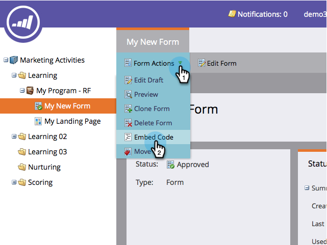

# 在您的網站上內嵌表單 {#embed-a-form-on-your-website}

Marketo可讓您將我們的表單內嵌在您自己的網站上。 以下說明如何取得內嵌程式碼的存取權。

1. 前往 **行銷活動**.

   

1. 尋找並選取您的表單。

   

1. 下 **表單動作**，按一下 **內嵌程式碼**.

   >[!NOTE]
   >
   >表單必須獲得以下專案的核准： **內嵌程式碼** 專案可見/可用。

   

   >[!CAUTION]
   >
   >**[表單預填](/help/marketo/product-docs/administration/settings/edit-landing-page-settings.md)** 在您自己的頁面上使用表單內嵌程式碼時無法運作 _或_ Marketo登陸頁面。 「表單預填」僅適用於透過「插入元素」選項在Marketo登入頁面中使用表單時。

1. 選取/複製內嵌程式碼，然後按一下 **關閉**.

   

>[!TIP]
>
>將程式碼內嵌到您的網站後，Marketo中對表單所做的任何變更都將在表單核准後推送至您的網站。 您不需要對程式碼進行更多變更。

現在，只需將內嵌程式碼提供給您的網頁開發人員，讓他們將其新增至您的網站即可。

>[!NOTE]
>
>如果您的開發人員想要自訂外觀或存取進階API函式，請將 [Forms 2.0開發人員頁面](https://developers.marketo.com/documentation/websites/forms-2-0/).

做得好！ 您是否希望 [內嵌程式碼以包含Lightbox程式碼](/help/marketo/product-docs/demand-generation/forms/form-actions/use-a-form-in-a-lightbox.md)？ 這也很容易！
