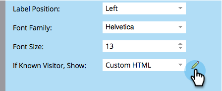

# 顯示已知人員的自訂HTML表單 {#show-custom-html-form-for-known-people}

如果訪客已確認（過去提供電子郵件地址的已知人員），為何還要麻煩使用表單？ 只要給他們下載按鈕即可。 方法如下。

1. 前往 **行銷活動**.

   

1. 下 **行銷活動**，選取您的表單並按一下 **編輯表單**.

   

1. 下 **表單設定**，按一下 **設定**.

   

1. 設定條件 **已知訪客，節目**：至 **自訂HTML**.

   

1. 按一下  若要編輯 **自訂HTML** 會向已知人員顯示。

   

1. 有一些預設內容，但您可以隨意變更。

   

   可用Token：

   | Token | 說明 |
   |---|---|
   | `{{lead.FirstName}}` | 這會顯示個人的名字。 |
   | `{{lead.LastName}}` | 這會顯示人員的姓氏。 |
   | `{{form.Button:default=Download}}` | 這會顯示表單按鈕。 取代之後的區域 `=` 以變更按鈕文字。 |
   | `{{form.NotYou:default=Not you?}}` | 若此人是其他人，此畫面會顯示連結。 取代之後的區域 `=` 以變更連結文字。 |

   >[!CAUTION]
   >
   >只能使用上述四個代號。 此處無法使用任何其他權杖。

1. 按一下 **完成**.

   

1. 按一下 **核准並關閉**.

   >[!NOTE]
   >
   >此表單必須經過核准才能用於登陸頁面。

   

   >[!NOTE]
   >
   >記住 [核准登入頁面草稿](/help/marketo/product-docs/demand-generation/landing-pages/understanding-landing-pages/approve-unapprove-or-delete-a-landing-page.md) 由表單變更所建立。

   蛋糕！ 檢視人員返回相同表單時會看到什麼內容：

   

   >[!TIP]
   >
   >您可以將表單後續追蹤頁面設定為檔案的URL，將按鈕的點選導向資產。
