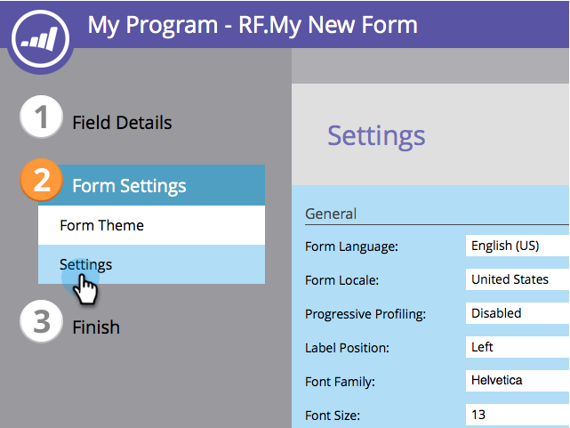

# 變更表單標籤位置 {#change-form-label-position}

當[建立表單](/help/marketo/product-docs/demand-generation/forms/creating-a-form/create-a-form.md)時，您可以非常輕鬆地變更表單欄位標籤的位置。 方法如下。

1. 移至&#x200B;**[!UICONTROL Marketing Activities]**。

   

1. 選取您的表單並按一下&#x200B;**[!UICONTROL Edit Form]**。

   

1. 選擇「**[!UICONTROL Settings]**」。

   

1. 選取您想要的&#x200B;**[!UICONTROL Label Position]**。

   

   您目前有兩個選項：

   * [!UICONTROL Left] （預設）
   * [!UICONTROL Above]

1. 按一下「**[!UICONTROL Finish]**」。

   

1. 按一下「**[!UICONTROL Approve and Close]**」。

   >[!NOTE]
   >
   >此表單必須經過核准才能用於登入頁面。

   

   >[!NOTE]
   >
   >記得要核准由表單變更建立的登入頁面草稿。

做得好！ 瞭解變更表單上的標籤位置有多容易？ 好，讓我們看看變更表單標籤的字型可以做些什麼。

>[!MORELIKETHIS]
>
>[變更表單字型系列](/help/marketo/product-docs/demand-generation/forms/form-design/change-the-form-font-family.md)
