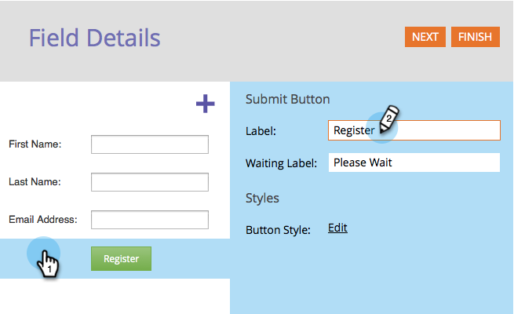

# 變更表單提交按鈕文字 {#change-form-submit-button-text}

您可以快速輕鬆地將表單按鈕從「提交」變更為任何其他單字。 方法如下。

1. 前往 **[!UICONTROL Marketing Activities]**。

   

1. 選取您的表單並按一下&#x200B;**[!UICONTROL Edit Form]**。

   

1. 選取按鈕並變更&#x200B;**[!UICONTROL Label]**。

   

   >[!TIP]
   >
   >請注意，您也可以變更「等待中」標籤。 這會在按一下按鈕之後以及表單提交動作完成之前顯示。

1. 按一下「**[!UICONTROL Finish]**」。

   

1. 按一下「**[!UICONTROL Approve and Close]**」。

   

   
