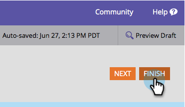

# 變更表單提交按鈕文字 {#change-form-submit-button-text}

您可以迅速輕鬆地將表單按鈕從「提交」變更為任何其他字詞。 這是方法。

1. 前往「行 **銷****活動」**。

   

1. 選擇您的表單，然後按一 **下「編輯****表單**」。

   

1. 選擇該按鈕並更改 **標籤**。

   

   >[!TIP]
   >
   >請注意，您也可以變更「等待標籤」。 在按一下按鈕後，表單提交動作完成前，就會顯示這個動作。

1. 按一 **下完成**。

   

1. 按一 **下「核准並關閉**」。

   

   砰！

   

