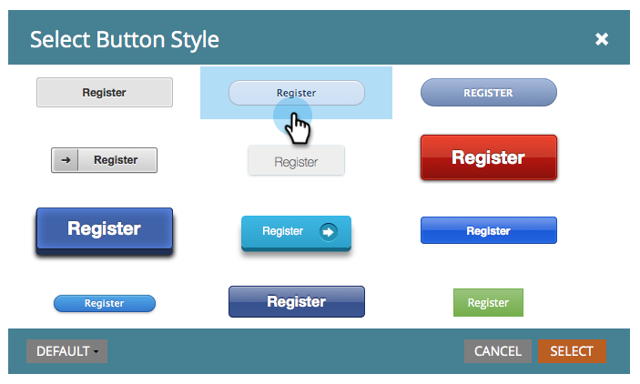
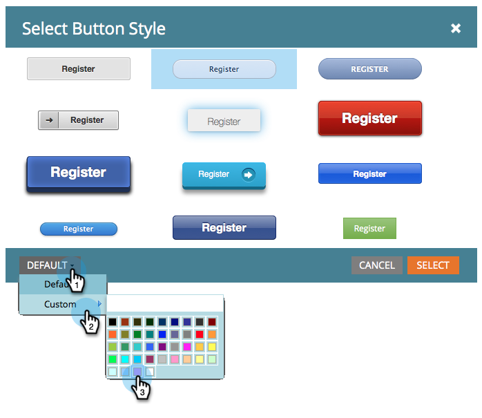

# 變更提交按鈕樣式和顏色 {#change-submit-button-style-and-color}

如果您發現標準提交按鈕很枯燥，或者您需要一些更精緻的按鈕，歡迎您選擇多種現成的按鈕樣式。

1. 前往 **行銷活動**.

   

1. 選擇您的表單並按一下 **編輯表單**.

   

1. 選取 **提交** 按鈕並按一下 **編輯** 按鈕樣式旁邊。

   

   >[!TIP]
   >
   >您知道您可以拖曳提交按鈕至左側或右側來變更其位置嗎？ 這很容易。 試試看！

1. 挑選您喜歡的按鈕樣式（向上/向下捲動）。

   

1. 您可以保留顏色為預設值或加以自訂。

   

   >[!TIP]
   >
   >您也可以手動輸入色彩代碼。

1. 按一下 **選取**.

   

1. 按一下 **完成**.

   

1. 按一下 **核准並關閉**.

   

   好了！

   

   >[!NOTE]
   >
   >和許多圖形元素一樣，按鈕的外觀可能會因您使用的瀏覽器而有所不同。
