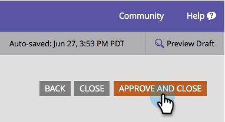

# 變更表單字型系列 {#change-the-form-font-family}

Google字型內建在表單編輯器中。

>[!NOTE]
>
>此設定會影響表單標籤、輸入文字和任何RTF文字。

1. 前往 **[!UICONTROL Marketing Activities]**。

   

1. 選取您的表單並按一下&#x200B;**[!UICONTROL Edit Form]**。

   

1. 在&#x200B;**[!UICONTROL Form Settings]**&#x200B;下，選取&#x200B;**[!UICONTROL Settings]**。

   

1. 選取您想要的&#x200B;**[!UICONTROL Font Family]**。

   >[!TIP]
   >
   >一組[Google字型](https://fonts.google.com/){target="_blank"}可供使用。

   

1. 按一下「**[!UICONTROL Finish]**」。

   

1. 按一下「**[!UICONTROL Approve and Close]**」。

   >[!NOTE]
   >
   >此表單必須經過核准才能用於登入頁面。

   

   >[!NOTE]
   >
   >記得要核准由表單變更建立的登入頁面草稿。

   

>[!MORELIKETHIS]
>
>[變更表單字型大小](/help/marketo/product-docs/demand-generation/forms/form-design/change-the-form-font-size.md)
