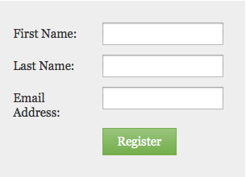

# 更改表單字型大小 {#change-the-form-font-size}

Marketo可讓您輕鬆自訂表單的外觀和風格。 您可以更改字型大小。 這是方法。

>[!TIP]
>
>此設定會影響表單標籤、輸入文字和提交按鈕文字。

1. 前往 **行銷活動**.

   

1. 選取您的表單並按一下 **編輯表單**.

   

1. 在 **表單設定**，選擇 **設定**.

   

1. 選取 **字型大小** 你想要。

   

1. 按一下 **完成**.

   

1. 按一下 **核准並關閉**.

   >[!NOTE]
   >
   >表單必須經過核准，才能用於登錄頁面。

   

   >[!NOTE]
   >
   >請記得核准表單變更所建立的登錄頁面草稿。

   

蛋糕！ 你懂的。
