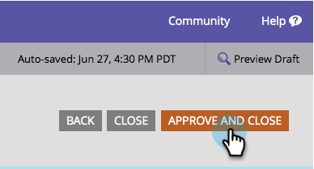
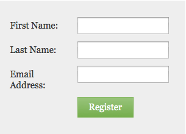

# 變更表單字體大小 {#change-the-form-font-size}

Marketo可讓您輕鬆自訂表單的外觀和風格。 您可能想要變更字型大小。 方法如下。

>[!TIP]
>
>此設定會影響表單標籤、輸入文字及提交按鈕文字。

1. 前往 **[!UICONTROL Marketing Activities]**。

   

1. 選取您的表單並按一下&#x200B;**[!UICONTROL Edit Form]**。

   

1. 在&#x200B;**[!UICONTROL Form Settings]**&#x200B;下，選取&#x200B;**[!UICONTROL Settings]**。

   

1. 選取您想要的&#x200B;**[!UICONTROL Font Size]**。

   

1. 按一下「**[!UICONTROL Finish]**」。

   

1. 按一下「**[!UICONTROL Approve and Close]**」。

   >[!NOTE]
   >
   >此表單必須經過核准才能用於登入頁面。

   

   >[!NOTE]
   >
   >記得要核准由表單變更建立的登入頁面草稿。

   

小菜一碟！ 您有這個。
