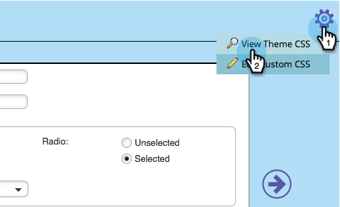

# 編輯表單主題的CSS {#edit-the-css-of-a-form-theme}

您有幾個預先建立的 [您可從中選擇主題](/help/marketo/product-docs/demand-generation/forms/creating-a-form/select-a-form-theme.md). 但如果您喜歡編輯CSS，則可進行您想要的任何變更。 方法如下。

>[!NOTE]
>
>如果您想要嘗試此動作，請務必知道CSS，因為Marketo支援未設定為協助自訂編碼。 此外，所做的任何變更只會套用至您目前編輯的表單。

1. 前往 **行銷活動**.

   

1. 選擇您的表單並按一下 **編輯表單**.

   

1. 前往 **表單設定**.

   

1. 選取您要變更的主題。

   

1. 在齒輪圖示下，按一下 **檢視主題CSS**.

   

1. 歡迎您剪下/貼上此CSS至您自己的編輯器。 其為唯讀，因此您只需要覆寫CSS。

   

1. 按一下 **關閉**。

   

1. 在齒輪圖示下，按一下 **編輯自訂CSS**.

   

1. 輸入您的自訂CSS。 您不需要所有的，只需要不同的零件。

   

1. 完成後，按一下 **儲存**.

   

1. 若要檢視自訂表格，請按一下 **預覽草稿**.

   

就是這樣！
