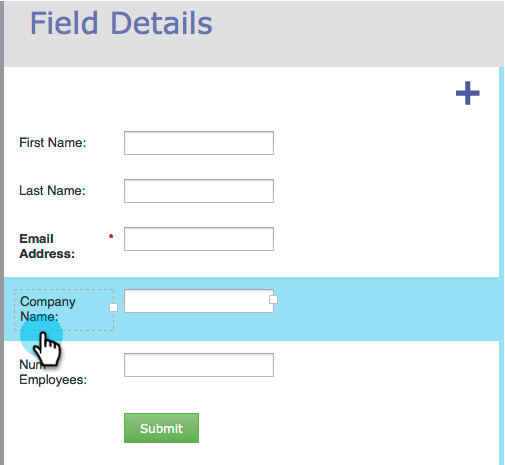
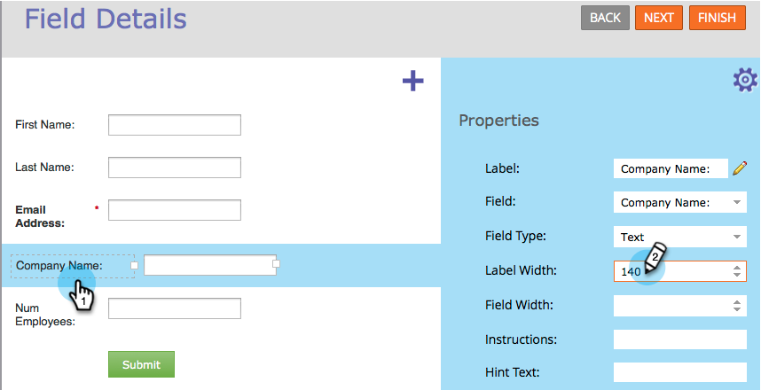

# 調整表單中的標籤/欄位寬度 {#resize-label-field-width-in-a-form}

有兩種方式可以調整欄位標籤寬度和欄位寬度本身的大小。

## 拖放寬度 {#drag-and-drop-the-width}

1. 在 [表單編輯器](/help/marketo/product-docs/demand-generation/forms/form-actions/edit-a-form.md)，選擇要調整大小的欄位。

   

1. 拖曳標籤角或欄位角以調整大小。

   

## 手動輸入寬度 {#enter-the-width-manually}

1. 選擇要調整大小的欄位。

   

1. 為「標籤寬度」和/或「欄位寬度」輸入像素值。

   

幹得好！ 很簡單，對吧？
