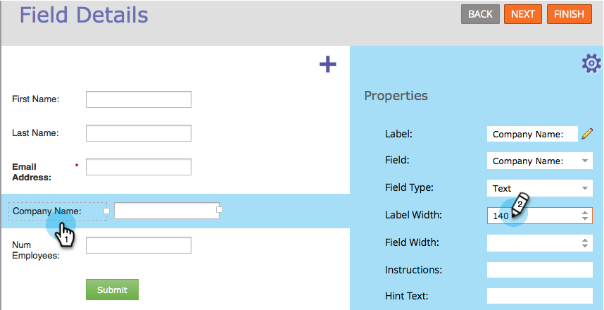

# 調整表單中標籤/欄位的寬度 {#resize-label-field-width-in-a-form}

有兩種方式可調整欄位標籤寬度和欄位寬度本身。

## 拖放寬度 {#drag-and-drop-the-width}

1. 在[表單編輯器](/help/marketo/product-docs/demand-generation/forms/form-actions/edit-a-form.md)中，選取您要調整大小的欄位。

   

1. 拖曳標籤邊角或欄位邊角以調整大小。

   

## 手動輸入寬度 {#enter-the-width-manually}

1. 選取要調整大小的欄位。

   

1. 輸入[!UICONTROL Label Width]和/或[!UICONTROL Field Width]的畫素值。

   

做得好！相當簡單，對吧？
