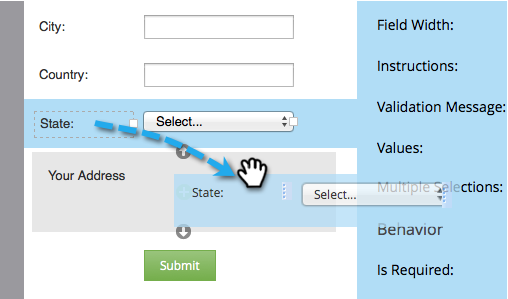

# 新增欄位集至表單 {#add-a-fieldset-to-a-form}

欄位集將一棧欄位群組在一起。 您可以一次控制整個區塊。

1. 前往 **[!UICONTROL Marketing Activities]**。

   

1. 選取您的表單並按一下&#x200B;**[!UICONTROL Edit Form]**。

   

1. 按一下&#x200B;**+**&#x200B;符號並選取&#x200B;**[!UICONTROL Fieldset]**。

   

1. 選取&#x200B;**欄位集**&#x200B;並輸入&#x200B;**[!UICONTROL Label]**。

   

1. 將您想要的欄位拖曳至&#x200B;**欄位集**。

   

1. 下列專案顯示完成時的外觀。

   

>[!TIP]
>
>您可以根據其他欄位動態隱藏/顯示整個欄位集。 瞭解[可見性規則](/help/marketo/product-docs/demand-generation/forms/form-fields/dynamically-toggle-visibility-of-a-form-field.md)。
