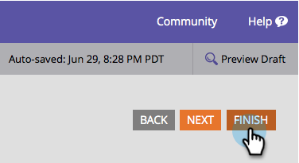

# 將輸入掩碼應用於{#apply-input-masking-to-a-field-in-a-form}格式的欄位

您可以使用輸入遮色片限制訪客的輸入。 例如，您可能希望訪客僅以特定格式輸入電話號碼。

1. 前往&#x200B;**Marketing** **Activity**。

   

1. 選擇表單並按一下「編輯」******「表單」**。

   

1. 選擇欄位，並確保&#x200B;**欄位** **類型**&#x200B;設定為&#x200B;**文本**。

   >[!NOTE]
   >
   >輸入遮色片僅適用於&#x200B;**文字欄位類型**。

   

1. 按一下&#x200B;**掩碼** **輸入**&#x200B;連結。

   

1. 輸入輸入掩碼，然後按一下「保存」。****

   

   >[!NOTE]
   >
   >請注意遮色片規則。 您可以限制輸入數字、字母、兩者和／或甚至限制輸入的字元數。

1. 按一下&#x200B;**完成**。

   

1. 按一下「核准並關閉」。****

   

   看看！ 現在，您要求訪客以特定格式輸入數字。

   

   >[!NOTE]
   >
   >該欄位不能顯示如上圖所示的預定義區域。 在訪客開始輸入數字之前，它可能會顯示為空白，然後會自動符合您為欄位定義的輸入格式。

很酷吧？
