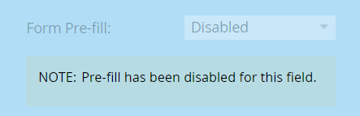

# 停用表單欄位{#disable-pre-fill-for-a-form-field}的預填

已知Web訪客(Cookie)時，Marketo表單會預先填入欄位中的資訊。 如果你想關掉它，請看如何做。

>[!NOTE]
>
>**預設啟** 用表單篩選。著陸頁面層級預先填滿設定和管理員層級預先填寫設定，高於表單層級設定：
>
>表單>著陸頁面>管理

## 如何禁用預填充{#how-to-disable-pre-fill}

1. 前往&#x200B;**行銷活動**。

   

1. 選擇表單並按一下「編輯表單」。****

   

   >[!CAUTION]
   >
   >在您自己的頁面上內嵌表格時，表格預填無法運作。 它只適用於Marketo登陸頁面。

1. 選擇其中一個欄位，並將「表單預填充&#x200B;**」設定為「禁用**」。****

   

   >[!TIP]
   >
   >您也可以在登陸頁面層級或管理層級停用表單預先填寫。

1. 按一下&#x200B;**完成**。

   

1. 按一下「核准並關閉」。****

   

## 敏感欄位{#sensitive-fields}

當您[將欄位標示為sensitive](/help/marketo/product-docs/administration/field-management/mark-a-field-as-sensitive.md)，而無法預先填入其值時，您會在「預先填入」選項中看到這一點。

