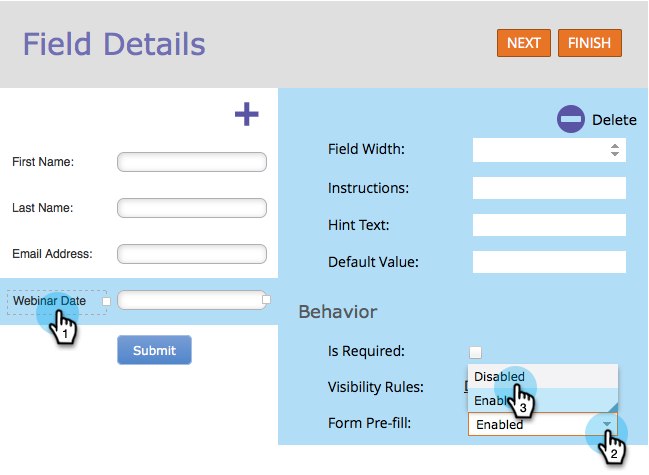
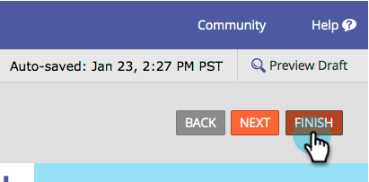

# 停用表單欄位預先填入 {#disable-pre-fill-for-a-form-field}

當網路訪客是已知的（已編碼），Marketo表單預設會使用欄位資訊預先填寫欄位。 如果您想要關閉此功能，請參閱以下操作說明。

>[!NOTE]
>
>預設會啟用&#x200B;**表單預填**。 登陸頁面層級預填設定和管理員層級預填設定優先於表單層級設定：
>
>表單>登陸頁面>管理員

## 如何停用預填 {#how-to-disable-pre-fill}

1. 前往 **[!UICONTROL Marketing Activities]**。

   

1. 選取您的表單並按一下&#x200B;**[!UICONTROL Edit Form]**。

   

   >[!CAUTION]
   >
   >將表單內嵌在您自己的頁面上時，表單預填無法運作。 它只適用於Marketo登陸頁面。

1. 選取其中一個欄位並將&#x200B;**[!UICONTROL Form Pre-fill]**&#x200B;設為&#x200B;**[!UICONTROL Disabled]**。

   

   >[!TIP]
   >
   >您也可以停用登入頁面層級或管理員層級的表單預填。

1. 按一下「**[!UICONTROL Finish]**」。

   

1. 按一下「**[!UICONTROL Approve and Close]**」。

   

## 敏感欄位 {#sensitive-fields}

當您[將欄位標示為敏感欄位](/help/marketo/product-docs/administration/field-management/mark-a-field-as-sensitive.md)，以防止其值預先填入表單時，您會在預先填入選項中看到此選項。

