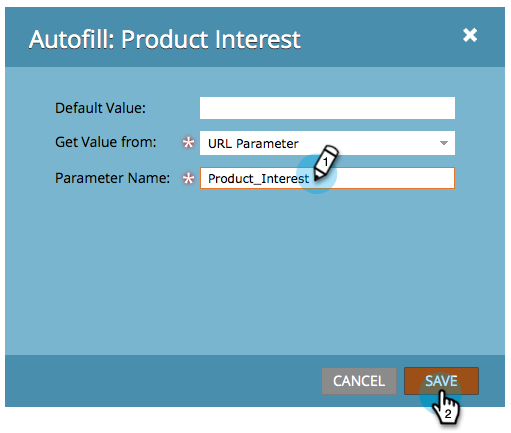
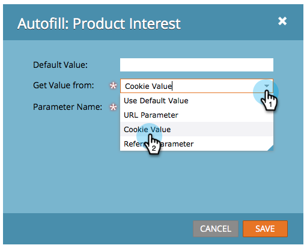
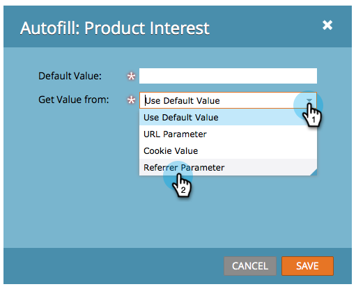

# 設定隱藏表單欄位值 {#set-a-hidden-form-field-value}

隱藏欄位通常會動態填入。 未向填寫表單的人顯示。 以下說明設定值的方式。

>[!PREREQUISITES]
>
>[將表單欄位設定為隱藏](/help/marketo/product-docs/demand-generation/forms/form-fields/set-a-form-field-as-hidden.md)

## 選取欄位 {#select-the-field}

1. 在您的表單中，選取隱藏欄位並按一下&#x200B;**[!UICONTROL Autofill]**&#x200B;的&#x200B;**[!UICONTROL Edit]**。

   

## 使用預設值 {#use-default-value}

透過選取「使用&#x200B;**[!UICONTROL Default Value]**」，您可以硬式編碼特定值，以便在提交此表單時一律使用。 輸入&#x200B;**[!UICONTROL Default Value]**&#x200B;並按一下&#x200B;**[!UICONTROL Save]**。

## URL 參數 {#url-parameter}

如果您想要在填寫表單時從人員所在的頁面擷取URL引數（查詢字串），您可以使用&#x200B;**[!UICONTROL URL Parameters]**&#x200B;填入您的隱藏欄位。

>[!NOTE]
>
>引數是技術性的。 一旦您瞭解這些功能，就表示它們是強大的。 查詢字串](https://en.wikipedia.org/wiki/Query_string)上的這個[Wikipedia頁面有些幫助。

1. 為&#x200B;**[!UICONTROL Get Value Type]**&#x200B;選取&#x200B;**[!UICONTROL URL Parameter]**。

   

1. 輸入&#x200B;**[!UICONTROL Parameter Name]**&#x200B;並按一下&#x200B;**[!UICONTROL Save]**。

   

>[!TIP]
>
>如果找不到URL引數，您可以輸入&#x200B;**[!UICONTROL Default Value]**。

## Cookie值 {#cookie-value}

如果您要將資料儲存在Cookie中，您可以在提交表單時使用&#x200B;**[!UICONTROL Cookie Value]**&#x200B;擷取資料。

1. 為&#x200B;**[!UICONTROL Get Value From]**&#x200B;選取&#x200B;**[!UICONTROL Cookie Value]**。

   

1. 輸入您想要的Cookie **[!UICONTROL Parameter Name]**&#x200B;並按一下&#x200B;**[!UICONTROL Save]**。

   

   >[!TIP]
   >
   >您可以輸入&#x200B;**[!UICONTROL Default Value]**，以備找不到引數/Cookie時使用。

## 反向連結引數 {#referrer-parameter}

如果您想要在填寫表單前從訪客來自的頁面擷取資料，可以使用&#x200B;**[!UICONTROL Referrer Parameter]**。

1. 將&#x200B;**[!UICONTROL Get Value From]**&#x200B;設為&#x200B;**[!UICONTROL Referrer Parameter]**。

   

1. 輸入您要從反向連結URL擷取的&#x200B;**[!UICONTROL Parameter Name]**，然後按一下&#x200B;**[!UICONTROL Save]**。

   

   >[!TIP]
   >
   >您可以輸入&#x200B;**[!UICONTROL Default Value]**，以備找不到反向連結引數時使用。

1. 按一下「**[!UICONTROL Finish]**」。

   

1. 按一下「**[!UICONTROL Approve and Close]**」。

   
