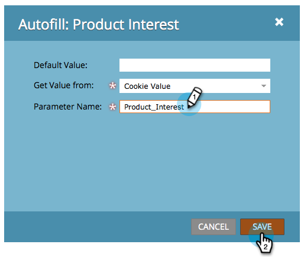

# 設定隱藏的表單欄位值 {#set-a-hidden-form-field-value}

隱藏欄位通常會動態填入。 它們不會顯示給填寫表單的人。 以下說明設定值的方式。

>[!PREREQUISITES]
>
>[將表單欄位設定為隱藏](/help/marketo/product-docs/demand-generation/forms/form-fields/set-a-form-field-as-hidden.md)

## 選取欄位 {#select-the-field}

1. 在您的表單中，選取隱藏欄位並按一下 **編輯** 的 **自動填寫**.

   

## 使用預設值 {#use-default-value}

透過選取「使用預設值」，您可以對特定值進行硬式編碼，以便在提交此表單時始終使用。 輸入「預設值」並按一下「儲存」。

## URL引數 {#url-parameter}

如果您想要在填寫表單時從人員所在的頁面擷取URL引數（查詢字串），您可以使用 **URL引數** 以填入您的隱藏欄位。

>[!NOTE]
>
>引數有點技術性，不是嗎？ 不過，一旦您取得這些功能，就表示它們非常強大。 此 [查詢字串上的Wikipedia頁面](https://en.wikipedia.org/wiki/Query_string) 會有所幫助。

1. 選取 **URL引數** 的 **取得值型別**.

   

1. 輸入 **引數名稱** 並按一下 **儲存**.

   

>[!TIP]
>
>您可以輸入預設值，以備找不到URL引數時使用。

## Cookie值 {#cookie-value}

如果您要將資料儲存在Cookie中，您可以使用 **Cookie值** 以在表單提交時擷取資料。

1. 選取 **Cookie值** 的 **值取得來源**.

   

1. 輸入您想要的Cookie引數名稱，然後按一下 **儲存**.

   

   >[!TIP]
   >
   >您可以輸入預設值，以備找不到引數/Cookie時使用。

## 反向連結引數 {#referrer-parameter}

如果您想要在填寫表單前從訪客來自的頁面擷取資料，您可以使用 **反向連結引數**.

1. 設定 **值取得來源** 至 **反向連結引數**.

   

1. 輸入 **引數名稱** 從反向連結URL擷取並按一下 **儲存**.

   

   >[!TIP]
   >
   >您可以輸入 **預設值** 如果找不到反向連結引數。

1. 按一下 **完成**.

   

1. 按一下 **核准並關閉**.

   
