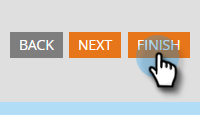
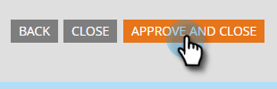

# 在MarketoForms啟用驗證碼 {#enable-captcha-in-marketo-forms}

您可以按表單啟用/禁用驗證碼。

1. 查找並選擇所需的窗體。

   

1. 按一下 **編輯草稿** （如果表單已被批准，請按一下「建立草稿」）。

   

1. 按一下 **窗體設定**，則 **設定**。

   

1. 開啟驗證碼下拉清單並選擇 **已啟用**。

   

1. 按一下 **完成**。

   

1. 按一下 **批准和關閉**。

   

>[!NOTE]
>
>對此清單的更改可能需要幾分鐘才能從Google傳播。
