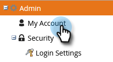
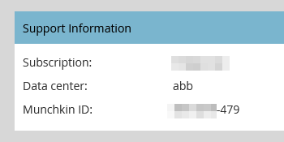

# 設定reCAPTCHA v3 {#setting-up-recaptcha-v3}

reCAPTCHA v3是一種無摩擦的體驗，它根據提交內容的可疑程度對它們進行分級，而不會使用文本、影像或按鈕挑戰。 [瞭解更多資訊](https://developers.google.com/search/blog/2018/10/introducing-recaptcha-v3-new-way-to){target=&quot;_blank&quot;}。

## 檢索您的資料中心和Munchkin ID {#retrieve-your-data-center-and-munchkin-id}

對於下面「初始reCAPTCHA v3設定」部分中的步驟6，您需要Marketo Engage訂閱的資料中心和Munchkin ID。 這是如何找到它們。

1. 在Marketo，按一下 **管理**。

   

1. 按一下 **我的帳戶**。

   

1. 向下滾動到「Support Information（支援資訊）」。

   

## 初始reCAPTCHA v3設定 {#initial-recaptcha-v3-setup}

在Marketo之外執行以下步驟。

1. 轉到 [https://www.google.com/recaptcha/about/](https://www.google.com/recaptcha/about/){target=&quot;_blank&quot;}，然後按一下v3Admin Console。

1. 登錄/註冊Google帳戶。

1. 按一下「建立」按鈕（+號）以建立新鍵。

1. 建立標籤以標識要用於Marketo Engage的密鑰。

1. 選擇類型 **reCAPTCHA v3**。 Marketo Engage當前不支援reCAPTCHA v2。

1. 添加Marketo Engage訂閱使用的每個域。 未在此處設定的域將在啟用reCAPTCHA的表單上返回錯誤。 切記將「資料中心」和「munchkinID」兩個詞替換為 [訂閱中的資料](#retrieve-your-data-center-and-munchkin-id)。

   * app-datacenter.marketo.com
   * munchkinID.mktoweb.com
   * 訂閱中配置的任何登錄頁域和別名

   >[!NOTE]
   >
   >例如，如果您帳戶的資料中心是「sjst」，則您允許的域 `app-sjst.marketo.com`。 如果Munchkin ID是123-ABC-789，則您允許的域將是 `123-ABC-789.mktoweb.com`。

1. 設定應接收有關此服務的任何警報的所有者和其他電子郵件地址。

1. 接受reCAPTCHA服務條款。

1. 按一下 **提交**。

>[!NOTE]
>
>使站點密鑰和密鑰在Marketo Engage配置中保持方便。

## 在Marketo Engage中設定驗證碼 {#setting-up-captcha-in-marketo-engage}

1. 在Marketo，按一下 **管理**。

   

1. 選擇 **驗證碼** 在樹上。

   

1. 按一下 **編輯** 驗證碼設定。

   

1. 按一下「驗證碼」下拉清單，然後選擇reCAPTCHA v3。

   

1. 插入密鑰和站點密鑰。 按一下 **保存** 完成。

   
