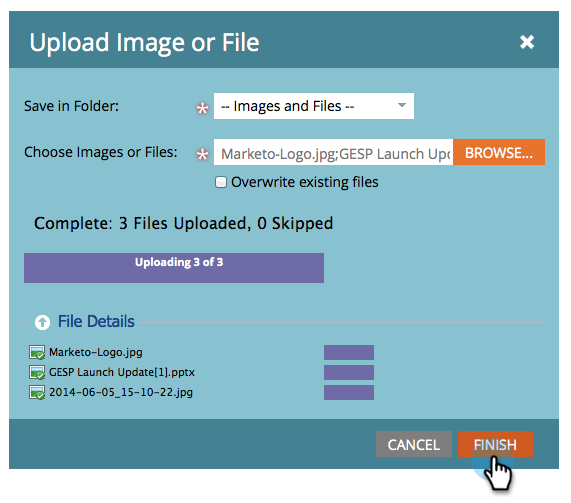

# 新增影像和檔案至Marketo {#add-images-and-files-to-marketo}

一次添加多個影像和檔案很容易。

1. 前往 **Design Studio**.

   

1. 在 **新增**，按一下 **上傳影像** 或 **檔案**.

   

1. 選擇要儲存影像或檔案的資料夾，然後按一下 **瀏覽**.

   

   >[!NOTE]
   >
   >每個檔案的最大大小為100MB。

1. 要添加多個影像和檔案，請瀏覽到電腦上的正確資料夾，按 **Ctrl/Cmd** 並按一下您要新增的每個檔案，然後按一下 **開啟**.

   

1. 展開 **檔案詳細資訊** 要驗證您選擇的映像是否正確，請按一下 **上傳**.

   

   >[!NOTE]
   >
   >若要在上傳前移除任何佇列的檔案，請按一下檔案名稱旁的x。

   >[!TIP]
   >
   >Marketo會先掃描所有檔案，再上傳；將跳過感染病毒的檔案。

1. 上傳完成時，按一下 **完成**.

   

1. 您的影像現在可用於行銷活動電子郵件和登錄頁面。

   

幹得好！

>[!NOTE]
>
>雖然Marketo接受所有要上傳的檔案類型，但只有主要影像類型(JPG、PNG、GIF等) 在電子郵件編輯器中運作。

>[!MORELIKETHIS]
>
>[使用資料夾組織影像和檔案](/help/marketo/product-docs/demand-generation/images-and-files/organize-your-images-and-files-using-folders.md)
