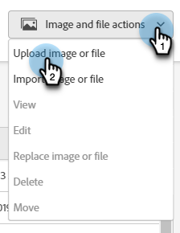

# 將影像和檔案新增至Marketo {#add-images-and-files-to-marketo}

瞭解如何將新影像或檔案新增至您的Marketo Engage執行個體。

1. 移至&#x200B;**設計工作室**。

   

1. 選取&#x200B;**[!UICONTROL 影像和檔案]**

   

1. 按一下&#x200B;**[!UICONTROL 影像和檔案動作]**&#x200B;下拉式清單，然後選取&#x200B;**[!UICONTROL 上傳影像或檔案]**。

   

1. 拖放所需的影像/檔案，或瀏覽電腦尋找該影像/檔案。

   

   >[!NOTE]
   >
   >每個檔案的大小上限為100MB。

1. 選取資產後，按一下&#x200B;**上傳**。

   

   >[!NOTE]
   >
   >雖然Marketo接受上傳的所有檔案型別，但只有主要的影像型別(JPG、PNG、GIF等) 可以在我們的電子郵件編輯器中運作。

   >[!MORELIKETHIS]
   >
   >[使用資料夾組織您的影像和檔案](/help/marketo/product-docs/demand-generation/images-and-files/organize-your-images-and-files-using-folders.md){target="_blank"}
