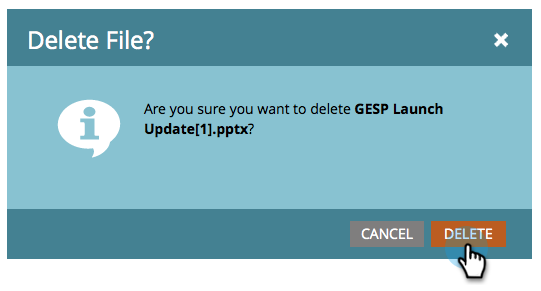

# 刪除上傳的影像或檔案 {#delete-an-uploaded-image-or-file}

1. 前往 **設計** **Studio**.

   

1. 選取 **影像和檔案** 在左側功能表中，然後按一下您要刪除之檔案的名稱旁的。

   

1. 按一下 **檔案動作** 下拉式清單並選取 **刪除**.

   

1. 確認您已選取正確的檔案，然後按一下 **刪除**.

   

   >[!CAUTION]
   >
   >已刪除的影像和檔案會從Marketo中完全移除，且無法復原。  這些變數將不再顯示於任何使用中的登陸頁面或電子郵件中。

1. 您將會返回 **影像** 和 **檔案** 頁面，您會看到檔案已刪除。

   

做得很好！

>[!MORELIKETHIS]
>
>* [取代上傳的影像或檔案](/help/marketo/product-docs/demand-generation/images-and-files/replace-an-uploaded-image-or-file.md)
>* [搜尋已上傳的影像和檔案](/help/marketo/product-docs/demand-generation/images-and-files/search-uploaded-images-and-files.md)
>* [尋找已上傳影像或檔案的URL](/help/marketo/product-docs/demand-generation/images-and-files/find-the-url-of-an-uploaded-image-or-file.md)
