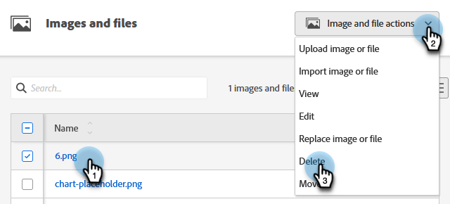

# 刪除已上傳的影像或檔案 {#delete-an-uploaded-image-or-file}

請依照下列步驟刪除上傳的影像或檔案。

>[!CAUTION]
>
>刪除後，影像/檔案會從Marketo Engage中完全移除，且無法復原。

1. 移至&#x200B;**[!UICONTROL Design Studio]**。

   

1. 選取&#x200B;**[!UICONTROL Images and Files]**

   

1. 尋找並選取所需的影像/檔案。 按一下「**[!UICONTROL Image and file actions]**」下拉式選單，選取「**[!UICONTROL Delete]**」。

   

1. 確認您已選取正確的檔案，然後按一下&#x200B;**[!UICONTROL Delete]**。

   

   >[!NOTE]
   >
   >Assets不會刪除目前是否有人使用。

>[!MORELIKETHIS]
>
>* [取代上傳的影像或檔案](/help/marketo/product-docs/demand-generation/images-and-files/replace-an-uploaded-image-or-file.md){target="_blank"}
>* [搜尋已上傳的影像和檔案](/help/marketo/product-docs/demand-generation/images-and-files/search-uploaded-images-and-files.md){target="_blank"}
>* [尋找已上傳影像或檔案的URL](/help/marketo/product-docs/demand-generation/images-and-files/find-the-url-of-an-uploaded-image-or-file.md){target="_blank"}
