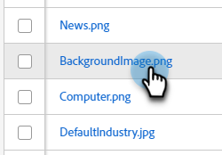

# 尋找已上傳影像或檔案的URL {#find-the-url-of-an-uploaded-image-or-file}

正在尋找您所上傳之影像或檔案的網址(URL)？

1. 前往 **[!UICONTROL Design Studio]**.

   

1. 按一下 **[!UICONTROL 影像和檔案]**.

   

1. 選取所需的資產。

   

1. 此 **[!UICONTROL URL]** 即會顯示在詳細資訊頁面上。

   

>[!MORELIKETHIS]
>
>[取代上傳的影像或檔案](/help/marketo/product-docs/demand-generation/images-and-files/replace-an-uploaded-image-or-file.md){target="_blank"}
