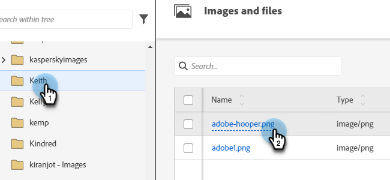

# 影像編輯器 {#image-editor}

影像編輯器可讓您以Marketo Engage對影像進行快速、輕鬆的編輯。

1. 移至&#x200B;**[!UICONTROL 設計工作室]**。

   

1. 找到並選取您的影像。

   

1. 按一下&#x200B;**[!UICONTROL 編輯影像]**&#x200B;按鈕。

   

1. 從頂端工具列中的各種功能中選擇。 完成時，按一下&#x200B;**[!UICONTROL 儲存]**。

   
