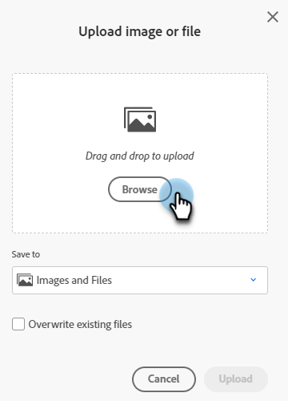

# 新增影像檔案 {#new-add-images-doc}

您有多個選項可以將新檔案/影像新增至「影像和檔案」存放庫。

## 上傳影像或檔案 {#upload-image-or-file}

1. 前往 **Design Studio**.

   

1. 選取 **[!UICONTROL 影像和檔案]**

   

1. 按一下 **[!UICONTROL 影像和檔案動作]** 下拉式清單並選取 **[!UICONTROL 上傳影像或檔案]**.

   

1. 拖放所需的影像/檔案，或瀏覽電腦尋找該影像/檔案。

   

1. 選取資產後，按一下 **上傳**.

   

## 匯入影像或檔案 {#import-image-or-file}

您有三種匯入影像的選項。 讓我們逐一檢視這些變數。

### 從網頁匯入 {#import-from-the-web}

文字

1. 遵循步驟1和2 [從上方](#upload-image-or-file).

1. 按一下 **[!UICONTROL 影像和檔案動作]** 下拉式清單並選取 **[!UICONTROL 匯入影像或檔案]**.

   

1. 選取 **[!UICONTROL Web]** 選項並按一下 **[!UICONTROL 下一個]**.

   

1. 在URL中輸入或貼上所需影像，然後按一下 **下一個**.

PICC

1. 按一下「空白」。

PICC

### 從方塊匯入 {#import-from-box}

文字

1. 遵循步驟1和2 [從上方](#upload-image-or-file).

1. 按一下 **[!UICONTROL 影像和檔案動作]** 下拉式清單並選取 **[!UICONTROL 匯入影像或檔案]**.

   

1. 選取 **[!UICONTROL 方塊]** 選項並按一下 **[!UICONTROL 下一個]**.

   

   >[!NOTE]
   >
   >如果您先前未執行此動作，系統會要求您登入Box帳戶以授予存取權。

1. 選取想要的Box資料夾，然後按一下 **[!UICONTROL 下一個]**.

   

1. 選取所需的影像，然後按一下 **[!UICONTROL 下一個]**.

   

1. 選取您要儲存影像的Marketo Engage資料夾。 在此範例中，我們會將其保留為「影像和檔案」（預設）。 按一下 **匯入**.

   

### 從Adobe Experience Manager匯入 {#import-from-adobe-experience-manager}

文字

1. 遵循步驟1和2 [從上方](#upload-image-or-file).

1. 按一下 **[!UICONTROL 影像和檔案動作]** 下拉式清單並選取 **[!UICONTROL 匯入影像或檔案]**.

   

1. 選取 **[!UICONTROL Adobe Experience Manager]** 選項並按一下 **[!UICONTROL 下一個]**.

   

   >[!NOTE]
   >
   >如果您先前未執行此動作，系統會要求您登入您的AEM帳戶。

1. 文字

PICC

1. 文字

PICC

1. 文字
