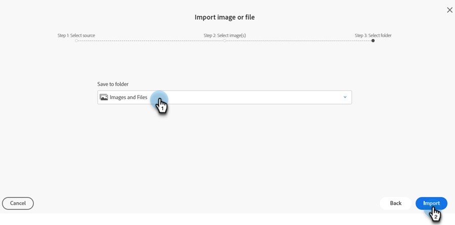
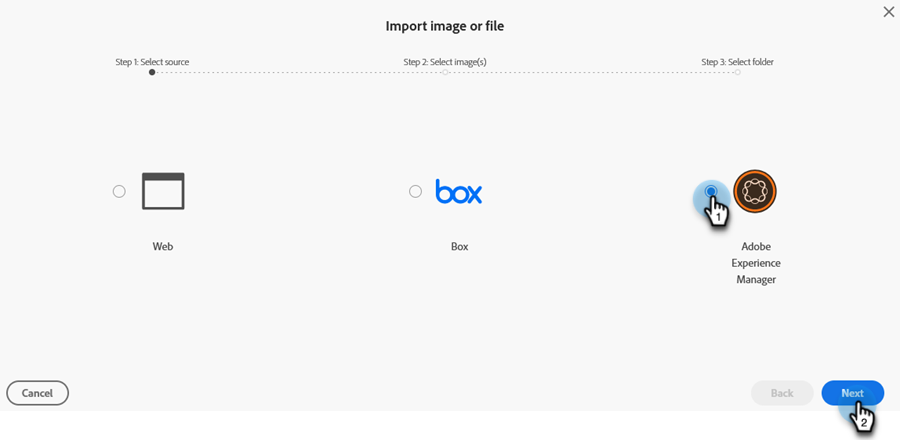

# 新的新增影像文件 {#new-add-images-doc}

您有多個選項可以將新檔案/影像新增至「影像和檔案」存放庫。

## 上傳影像或檔案 {#upload-image-or-file}

1. 移至&#x200B;**設計工作室**。

   

1. 選取&#x200B;**[!UICONTROL Images and Files]**

   

1. 按一下「**[!UICONTROL Image and file actions]**」下拉式選單，選取「**[!UICONTROL Upload image or file]**」。

   

1. 拖放所需的影像/檔案，或瀏覽電腦尋找該影像/檔案。

   

1. 選取資產後，按一下&#x200B;**上傳**。

   

## 匯入影像或檔案 {#import-image-or-file}

您有三種匯入影像的選項。 讓我們逐一檢視這些變數。

### 從網頁匯入 {#import-from-the-web}

文字

1. 請依照上述步驟1和2 [執行](#upload-image-or-file)。

1. 按一下「**[!UICONTROL Image and file actions]**」下拉式選單，選取「**[!UICONTROL Import image or file]**」。

   

1. 選取&#x200B;**[!UICONTROL Web]**&#x200B;選項並按一下&#x200B;**[!UICONTROL Next]**。

   

1. 在URL中輸入或貼上所要的影像，然後按一下[下一步] **&#x200B;**。

PICC

1. 按一下「空白」。

PICC

### 從方塊匯入 {#import-from-box}

文字

1. 請依照上述步驟1和2 [執行](#upload-image-or-file)。

1. 按一下「**[!UICONTROL Image and file actions]**」下拉式選單，選取「**[!UICONTROL Import image or file]**」。

   

1. 選取&#x200B;**[!UICONTROL Box]**&#x200B;選項並按一下&#x200B;**[!UICONTROL Next]**。

   

   >[!NOTE]
   >
   >如果您先前未執行此動作，系統會要求您登入Box帳戶以授予存取權。

1. 選取所需的Box資料夾，然後按一下&#x200B;**[!UICONTROL Next]**。

   

1. 選取所需的影像，然後按一下&#x200B;**[!UICONTROL Next]**。

   

1. 選取您要儲存影像的Marketo Engage資料夾。 在此範例中，我們會將其保留為「影像和檔案」（預設）。 按一下&#x200B;**匯入**。

   

### 從Adobe Experience Manager匯入 {#import-from-adobe-experience-manager}

文字

1. 請依照上述步驟1和2 [執行](#upload-image-or-file)。

1. 按一下「**[!UICONTROL Image and file actions]**」下拉式選單，選取「**[!UICONTROL Import image or file]**」。

   

1. 選取&#x200B;**[!UICONTROL Adobe Experience Manager]**&#x200B;選項並按一下&#x200B;**[!UICONTROL Next]**。

   

   >[!NOTE]
   >
   >如果您先前未執行此動作，系統會要求您登入您的AEM帳戶。

1. 文字

PICC

1. 文字

PICC

1. 文字
