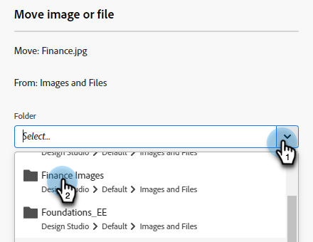

# 使用資料夾組織影像和檔案 {#organize-your-images-and-files-using-folders}

建立資料夾可讓您移動影像和檔案、檢視您想要的影像集，以及直接上傳至特定資料夾。

1. 移至&#x200B;**[!UICONTROL Design Studio]**。

   

1. 在&#x200B;**[!UICONTROL Images and Files]**&#x200B;上按一下滑鼠右鍵並選取&#x200B;**[!UICONTROL New folder]**。

   

1. 為資料夾命名，然後按一下 **[!UICONTROL Create]**。

   

1. 返回&#x200B;**[!UICONTROL Images and Files]**&#x200B;並選取您要移動的資產。 按一下「**[!UICONTROL Image and file actions]**」下拉式選單，選取「**[!UICONTROL Move]**」。

   

1. 選取所需的資料夾。

   

1. 按一下&#x200B;**移動移動**。

   

>[!MORELIKETHIS]
>
>[搜尋已上傳的影像和檔案](/help/marketo/product-docs/demand-generation/images-and-files/search-uploaded-images-and-files.md){target="_blank"}
