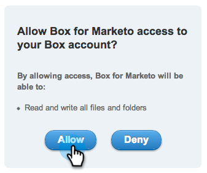

# 從 Box 上傳影像或檔案 {#upload-images-and-files-from-box}

您可以從Box上傳檔案，以用於登入頁面和電子郵件。

1. 移至&#x200B;**[!UICONTROL Design Studio]**。

   

1. 移至&#x200B;**[!UICONTROL Images and Files]**。 按一下&#x200B;**[!UICONTROL File Actions]**&#x200B;並選取&#x200B;**[!UICONTROL Grab Images from Web]**。

   

1. 按一下「**[!UICONTROL Box]**」。

   

1. 輸入您的[!DNL Box]登入資訊。

   

1. 允許Marketo存取您的[!DNL Box]帳戶。

   

1. 選擇要儲存檔案的位置。 然後選取您要從其中上載的&#x200B;**[!DNL Box]**&#x200B;資料夾。 按一下「**[!UICONTROL Next]**」。

   

1. 選取您要上載的檔案。 按一下「**[!UICONTROL Import]**」。

   

您的檔案現在已準備好用於您的登入頁面和電子郵件！
