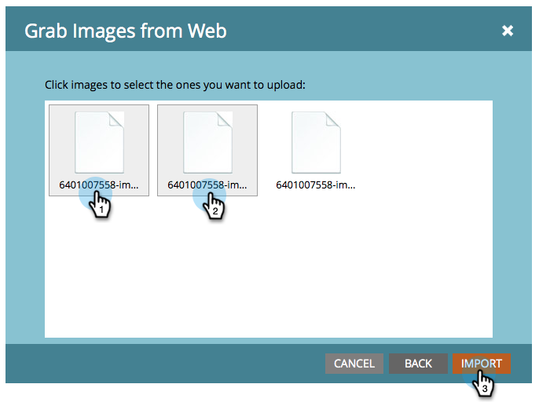

# 從方塊上傳影像和檔案 {#upload-images-and-files-from-box}

您可以從Box上傳檔案，以便用於登陸頁面和電子郵件。

1. 前往 **Design** **Studio**。

   

1. 前往**影像和檔案**。 按一 **下「檔案動作** 」並選 **取「從網頁擷取影像」**。

   

1. 按一 **下方塊**。

   

1. 輸入您的Box登入。

   

1. 允許Market存取您的Box帳戶。

   

1. 選擇要儲存檔案的位置。 然後，選 **擇要上** 傳的Box資料夾。 按一 **下「下一步**」。

   

1. 選取您要上傳的檔案。 按一 **下匯入**。

   

您的檔案現在已準備好可用於您的登陸頁面和電子郵件！