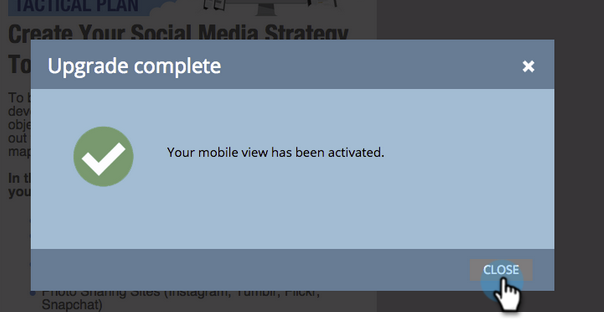

# 為自由格式登陸頁面新增行動裝置檢視 {#add-a-mobile-view-for-your-free-form-landing-page}

在智慧型手機上，讓自由格式的登陸頁面看起來更棒，這很簡單。

>[!NOTE]
>
>行動裝置檢視適用於寬度為480像素（或更低）的螢幕。 換句話說，智慧型手機。 以下是裝置解 [析度的詳細資訊](http://mydevice.io/devices/.)。

1. 前往行 **銷活動**。

   

1. 選擇自由格式登陸頁面。

   

1. 按一下「 **編輯草稿**」。

   

1. 按一下「 **行動** 」標籤。

   

1. 按一下「 **啟動**」。

   

   >[!CAUTION]
   >
   >自由格式範本可能需要升級。 如果您看到該訊息，請快速閱讀如何讓現 [有的自由表單登陸頁面範本與行動相容](../../../../product-docs/demand-generation/landing-pages/landing-page-templates/make-an-existing-free-form-landing-page-template-mobile-compatible.md)。

1. 太好了！ 您現在已啟動著陸頁面的行動版本。 按一下**關閉。 **

   

   您現在可以自 [訂行動裝置檢視](customize-mobile-view-for-your-free-form-landing-page.md)。

   

>[!MORELIKETHIS]
>
>* [自訂自由格式登陸頁面的行動裝置檢視](customize-mobile-view-for-your-free-form-landing-page.md)

>

