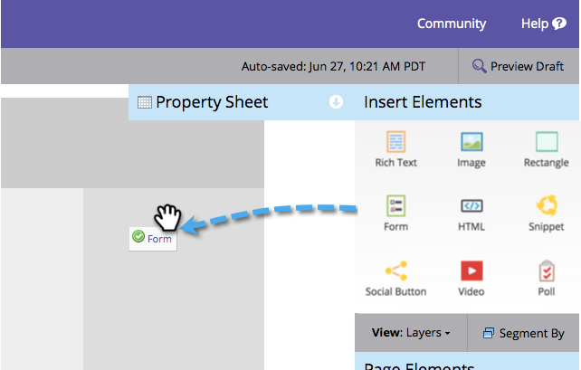
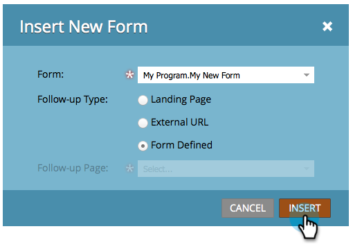

# 新增表單至自由表單登陸頁面 {#add-a-new-form-to-a-free-form-landing-page}

表單，符合登陸頁面。 登陸頁面，符合表單。

>[!PREREQUISITES]
>
>* [建立表單](/help/marketo/product-docs/demand-generation/forms/creating-a-form/create-a-form.md)
>* [建立自由格式的登陸頁面](/help/marketo/product-docs/demand-generation/landing-pages/free-form-landing-pages/create-a-free-form-landing-page.md)

1. 前往 **行銷活動**.

   

1. 尋找您的登入頁面，然後按一下 **編輯草稿**.

   

1. 拖放 **表單** 元素新增至頁面。

   

1. 尋找並選取您要新增的表單。

   

1. 選擇後續追蹤頁面時，有三個選項：

   * **登陸頁面**  — 挑選Marketo登陸頁面
   * **外部URL**  — 挑選您想要的URL
   * **已定義的表單**  — 使用表單層級定義的設定

   >[!NOTE]
   >
   >**定義**
   >
   >後續追蹤頁面是使用者提交表單後所看到的頁面。

1. 按一下 **插入**.

   

   做得很好！

只需關閉登入頁面編輯器並 [核准登入頁面草稿](/help/marketo/product-docs/demand-generation/landing-pages/understanding-landing-pages/approve-unapprove-or-delete-a-landing-page.md).
