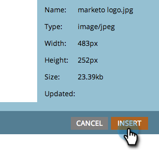

# 將影像新增至自由格式的登陸頁面 {#add-an-image-to-a-free-form-landing-page}

>[!PREREQUISITES]
>
>[將影像和檔案新增至Marketo](/help/marketo/product-docs/demand-generation/images-and-files/add-images-and-files-to-marketo.md)

1. 選取您的自由格式登陸頁面，然後按一下 **編輯** **草稿**.

   

1. 在編輯器中，拖曳至 **影像** 元素。

   

1. 尋找並選取您選擇的影像。

   

1. 按一下 **插入**.

   

   做得好！ 您剛才新增影像至您的自由格式登陸頁面。

   
