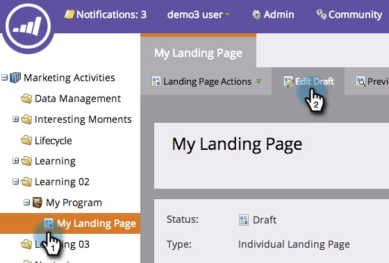

# 新增影像至自由格式登陸頁面 {#add-an-image-to-a-free-form-landing-page}

>[!PREREQUISITES]
>
>[新增影像和檔案至Marketo](/help/marketo/product-docs/demand-generation/images-and-files/add-images-and-files-to-marketo.md)

1. 選取您的自由格式登陸頁面，然後按一下&#x200B;**[!UICONTROL Edit Draft]**。

   

1. 在編輯器中，拖曳至&#x200B;**[!UICONTROL Image]**&#x200B;元素上方。

   

1. 尋找並選取您選擇的影像。

   

1. 按一下「**[!UICONTROL Insert]**」。

   

   您已將影像新增至您的自由格式登陸頁面。

   
