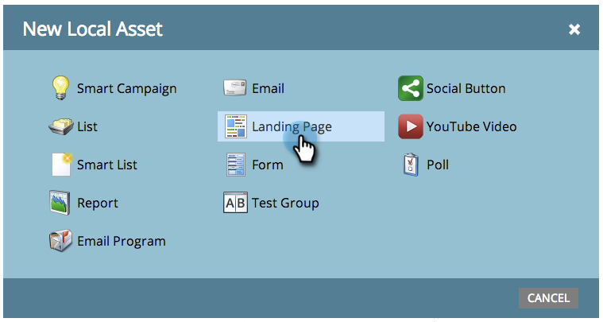
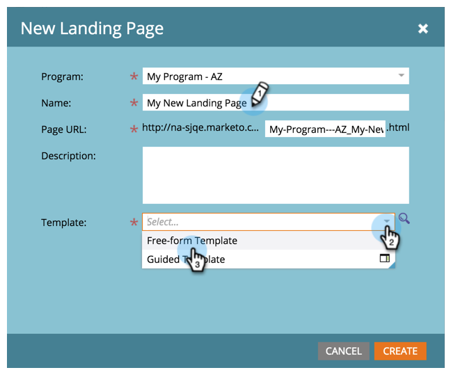
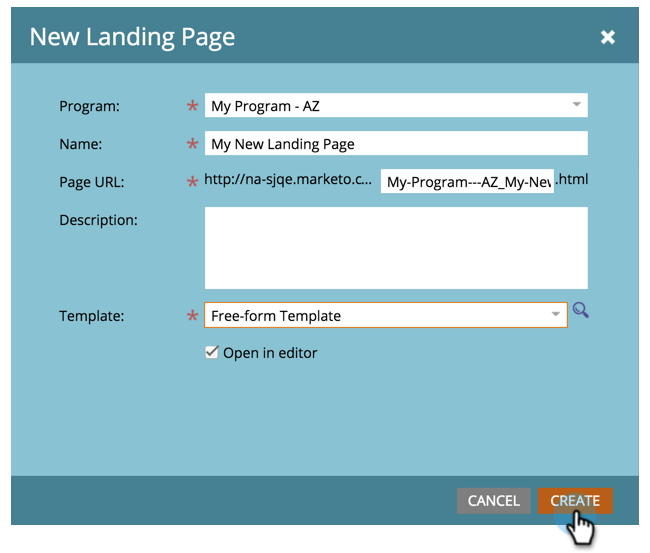
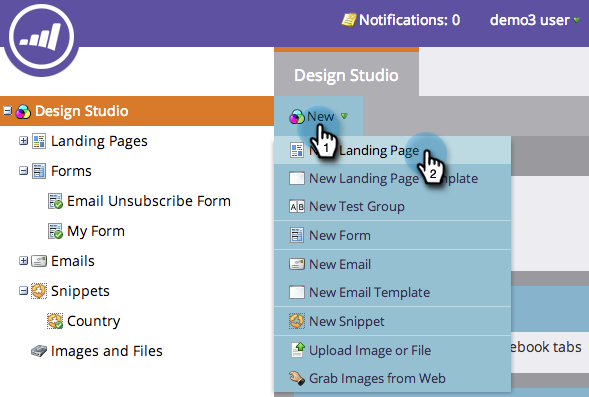
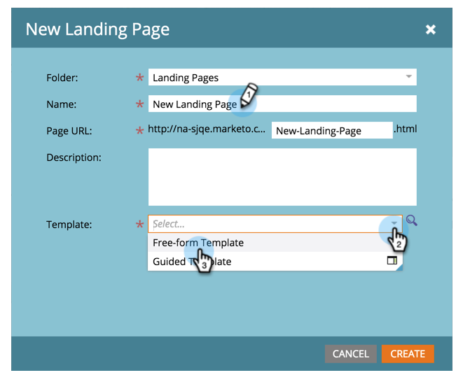
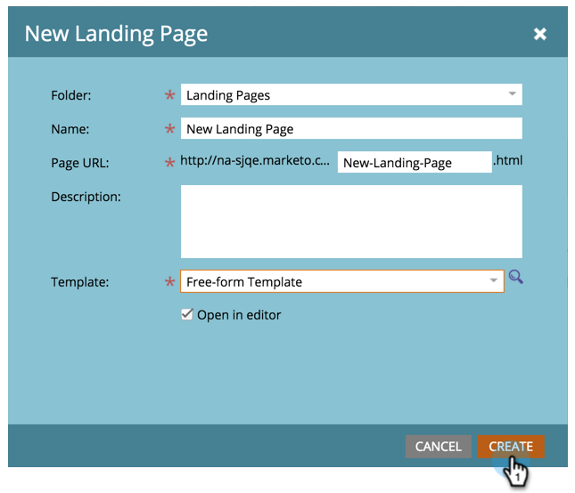

# 建立自由格式登陸頁面 {#create-a-free-form-landing-page}

自由格式登入頁面可建立為方案的本機資產，或在[!UICONTROL Design Studio]中建立以全域使用。

>[!NOTE]
>
>登入頁面模式由其範本定義。 [進一步瞭解](/help/marketo/product-docs/demand-generation/landing-pages/understanding-landing-pages/understanding-free-form-vs-guided-landing-pages.md)自由格式與引導式登陸頁面範本。

## 在程式中建立自由格式的登陸頁面 {#create-a-free-form-landing-page-in-a-program}

1. 前往 **[!UICONTROL Marketing Activities]**。

   

1. 按一下您的程式。

   

1. 按一下「**[!UICONTROL New]**」。 選取「**[!UICONTROL New Local Asset]**」。

   

1. 按一下&#x200B;**[!UICONTROL Landing Page]**。

   

1. 為登入頁面命名，並從下拉式選單中選擇任意格式的範本。

   >[!NOTE]
   >
   >沒有圖示的範本為自由格式。 自由格式範本允許完全自訂。

   

1. 按一下「**[!UICONTROL Create]**」。

   

>[!TIP]
>
>URL會自動從程式和登入頁面名稱建構。 若要變更URL，請編輯&#x200B;**[!UICONTROL Page URL]**&#x200B;欄位。

## 在Design Studio中建立自由形式的登陸頁面 {#create-a-free-form-landing-page-in-design-studio}

1. 移至&#x200B;**[!UICONTROL Design Studio]**。

   

1. 按一下&#x200B;**[!UICONTROL New]**，然後按&#x200B;**[!UICONTROL New Landing Page]**。

   

1. 為登入頁面命名，並從下拉式選單中選擇任意格式的範本。

   

1. 按一下「**[!UICONTROL Create]**」。

   

>[!TIP]
>
>如果您不想在按一下&#x200B;**[!UICONTROL Create]**&#x200B;後立即開啟編輯器，請取消勾選「[!UICONTROL Open landing page editor for new page]」。
