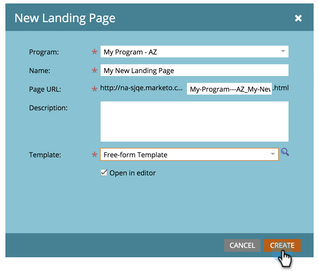

# 建立自由格式著陸頁面{#create-a-free-form-landing-page}

自由格式的登陸頁面可以建立為程式的本機資產，或在Design Studio中建立以供全球使用。

>[!NOTE]
>
>著陸頁面模式由其範本定義。 [進一](../../../../product-docs/demand-generation/landing-pages/understanding-landing-pages/understanding-free-form-vs-guided-landing-pages.md) 步瞭解自由格式和引導式登陸頁面範本。

## 在程式{#create-a-free-form-landing-page-in-a-program}中建立自由格式著陸頁面

1. 前往&#x200B;**行銷活動**。

   

1. 按一下您的計畫。

   

1. 按一下&#x200B;**新建**。 選擇&#x200B;**新建本地資產**。

   

1. 按一下「著陸頁面&#x200B;**」。**

   

1. 為著陸頁面命名，並從下拉式清單中選擇自由格式範本。

   >[!NOTE]
   >
   >沒有圖示的範本為自由格式。 自由格式範本允許完全自訂。

   

1. 按一下&#x200B;**建立**。

   

>[!TIP]
>
>URL會從程式和登陸頁面名稱自動建構。 若要變更URL，請編輯&#x200B;**頁面URL**&#x200B;欄位。

## 在Design Studio {#create-a-free-form-landing-page-in-design-studio}中建立自由格式著陸頁面

1. 前往&#x200B;**Design** **Studio**。

   

1. 按一下「**新增**」，然後按一下「新增著陸頁面」。****

   

1. 為著陸頁面命名，並從下拉式清單中選擇自由格式範本。

   

1. 按一下&#x200B;**建立**。

   

>[!TIP]
>
>如果您不希望編輯器在按一下&#x200B;**Create**&#x200B;後立即開啟，請取消勾選「Open landing page editor for new page」（開啟新頁面的著陸頁面編輯器）。

