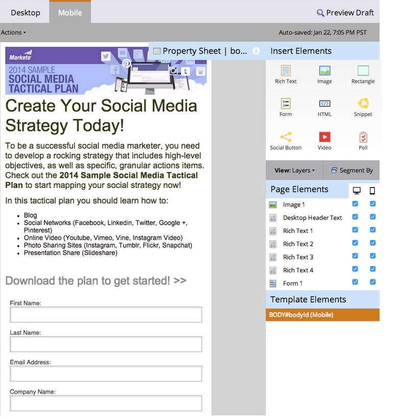

# 自訂您自由表單登陸頁面的行動裝置檢視 {#customize-mobile-view-for-your-free-form-landing-page}

>[!PREREQUISITES]
>
>[為您的自由格式登陸頁面新增行動裝置檢視](/help/marketo/product-docs/demand-generation/landing-pages/free-form-landing-pages/add-a-mobile-view-for-your-free-form-landing-page.md)

您的自由格式登陸頁面的行動檢視通常是自動的，但您可以加以自訂。 方法如下。

1. 選取您的自由格式登陸頁面。

   

1. 按一下 **編輯草稿**.

   

1. 按一下 **行動** 標籤。

   

## 行動與案頭檢視 {#mobile-vs-desktop-view}

在「頁面元素」下方，您會看到  （案頭）圖示和  （行動）圖示。 這可讓您以動態方式顯示/隱藏不同的元素。

預設情況下，案頭檢視上的所有內容都會顯示在行動檢視上。

>[!NOTE]
>
>矩形不會顯示在行動檢視上。

## 重要須知： {#important-things-to-know}

* 影像會展開至行動裝置的寬度。 如果您想要更小的影像，請拉入RTF元素，然後從那裡新增影像。
* 僅使用Forms 2.0表單。 它們會回應，且會自動調整。
* 只能編輯一個範本元素，BODY#bodyid （行動）。 您可以使用此項來變更背景顏色。

  

## 在行動檢視中隱藏元素 {#hide-an-element-from-the-mobile-view}

>[!TIP]
>
>行動裝置上的次數越少越好。 使用更少字詞，讓客戶更快樂。

1. 若要隱藏元素，請按一下行動欄下方的對應核取方塊。

   

1. 完美！ 該元素將不再會顯示在您的行動檢視中。

   

## 將元素新增至行動檢視 {#add-an-element-to-the-mobile-view}

>[!TIP]
>
>製作特殊（較短）內容，僅供行動檢視使用。

1. 若要新增元素，請將其拖放至自由格式的登陸頁面。

   

   確定元素已設定為僅在行動檢視上顯示。

   

>[!TIP]
>
>行動檢視也可以有不同的頁面元素排列。 在自由格式登陸頁面上四處移動，或重新排序下列出的物件 **頁面元素** 使用拖放。

## 預覽行動檢視 {#preview-mobile-view}

1. 按一下 **預覽草稿**.

   

1. 想看看酷炫的東西嗎？ 選取 **並排**.

   

1. 您現在可以同時檢視登陸頁面的案頭版和行動版！

   

1. 如果您喜歡，請按一下 **核准並關閉**.

   

   >[!NOTE]
   >
   >預覽不是互動式。 每部智慧型手機的顯示方式都有些不同。 我們建議您在幾個裝置上預覽您的登陸頁面，以瞭解登陸頁面的確切行為。

玩得開心！

>[!MORELIKETHIS]
>
>[讓現有的自由表單登陸頁面範本與行動裝置相容](/help/marketo/product-docs/demand-generation/landing-pages/landing-page-templates/make-an-existing-free-form-landing-page-template-mobile-compatible.md)
