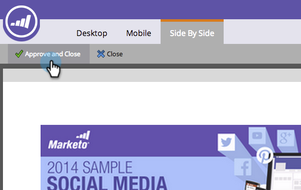

# 自訂自由格式登陸頁面的行動檢視{#customize-mobile-view-for-your-free-form-landing-page}

>[!PREREQUISITES]
>
>[為自由格式登陸頁面新增行動裝置檢視](/help/marketo/product-docs/demand-generation/landing-pages/free-form-landing-pages/add-a-mobile-view-for-your-free-form-landing-page.md)

自由格式登陸頁面的行動裝置檢視大部分是自動的，但您可以加以自訂。 這是方法。

1. 選取您的自由格式登陸頁面。

   

1. 按一下「編輯草稿&#x200B;**」。**

   

1. 按一下&#x200B;**Mobile**&#x200B;頁籤。

   

## 行動與案頭檢視{#mobile-vs-desktop-view}

在「頁面元素」下方，您會看到（案頭）圖示和（行動裝置）圖示。 這可讓您動態顯示／隱藏不同的元素。

依預設，案頭檢視上的所有項目都會顯示在行動檢視上。

>[!NOTE]
>
>矩形不會顯示在行動裝置檢視中。

## 重要事項：{#important-things-to-know}

* 影像會展開至行動裝置的寬度。 如果您想要較小的影像，請拉入富格文字元素，然後從中新增影像。
* 僅使用Forms 2.0表格。 它們回應速度快，而且會自動調整。
* 只有一個範本元素可編輯，即BODY#bodyid(Mobile)。 您可以使用它來變更背景顏色。

   

## 從Mobile View {#hide-an-element-from-the-mobile-view}中隱藏元素

>[!TIP]
>
>在行動裝置上，「少」更重要。 使用較少的字詞讓客戶更滿意。

1. 若要隱藏元素，請按一下行動欄下方的對應核取方塊。

   

1. 完美！ 該元素將不再出現在您的行動檢視中。

   

## 新增元素至Mobile View {#add-an-element-to-the-mobile-view}

>[!TIP]
>
>製作專為行動裝置檢視而製作的特殊（較短）內容。

1. 若要新增元素，請將其拖放至自由格式的登陸頁面。

   

   請確定元素已設為僅顯示在行動檢視上。

   

>[!TIP]
>
>行動檢視也可以有不同的頁面元素排列。 在自由格式登陸頁面上移動物件，或使用拖放方式重新排序列在&#x200B;**頁面元素**&#x200B;下方的物件。

## 預覽行動檢視{#preview-mobile-view}

1. 按一下「預覽草稿&#x200B;**」。**

   

1. 想看看酷炫的東西嗎？ 選擇「**並排**」。

   

1. 您現在可以同時檢視登陸頁面的案頭和行動版本！

   

1. 如果您喜歡，請按一下「核准並關閉」。****

   

   >[!NOTE]
   >
   >預覽不是互動式的。 每款智慧手機的顯示方式都略有不同。 我們建議在少數裝置上預覽您的著陸頁面，以確切瞭解著陸頁面的行為方式。

玩得開心！

>[!MORELIKETHIS]
>
>[讓現有的自由格式著陸頁面範本與行動相容](/help/marketo/product-docs/demand-generation/landing-pages/landing-page-templates/make-an-existing-free-form-landing-page-template-mobile-compatible.md)
