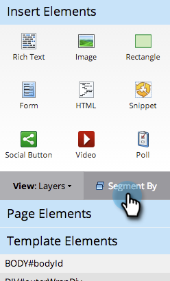
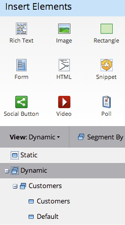
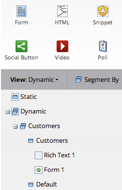

# 在自由格式登陸頁面中使用動態內容 {#use-dynamic-content-in-a-free-form-landing-page}

在登入頁面中使用動態內容，可讓您的對象獲得鎖定目標的資訊。

>[!PREREQUISITES]
>
>* [建立分段](/help/marketo/product-docs/personalization/segmentation-and-snippets/segmentation/create-a-segmentation.md)
>* [建立自由格式的登陸頁面](/help/marketo/product-docs/demand-generation/landing-pages/free-form-landing-pages/create-a-free-form-landing-page.md)
>* [新增表單至自由表單登陸頁面](/help/marketo/product-docs/demand-generation/landing-pages/free-form-landing-pages/add-a-new-form-to-a-free-form-landing-page.md)

## 新增分段 {#add-segmentation}

1. 前往 **[!UICONTROL Marketing Activities]**。

   

1. 選取您的登陸頁面，然後按一下&#x200B;**[!UICONTROL Edit Draft]**。

   

1. 按一下「**[!UICONTROL Segment By]**」。

   

1. 輸入[!UICONTROL Segmentation]名稱並按一下&#x200B;**[!UICONTROL Save]**。

   

1. 您的區段及其區段會顯示在右側的[!UICONTROL Dynamic]下方。

   

>[!NOTE]
>
>所有登入頁面元素預設為靜態。

## 將元素設為動態 {#make-element-dynamic}

1. 將動態內容元素從&#x200B;**[!UICONTROL Static]**&#x200B;底下拖放至&#x200B;**[!UICONTROL Dynamic]**。

   

1. 您也可以從元素&#x200B;**[!UICONTROL Settings]**&#x200B;建立元素&#x200B;**[!UICONTROL Static]**&#x200B;或&#x200B;**[!UICONTROL Dynamic]**。

   

## 套用動態內容 {#apply-dynamic-content}

1. 選取區段下的元素，按一下設定圖示，然後按一下&#x200B;**[!UICONTROL Edit]**。 對每個區段重複。

   

1. 綠色核取記號表示該區段的特定內容。 空白表示預設區段內容。

   

>[!CAUTION]
>
>對預設區段內容區塊的變更會套用至所有區段。

>[!TIP]
>
>在修改各種區段的內容之前，請先建立預設登陸頁面。

您現在可以將目標內容傳送至區段。

>[!MORELIKETHIS]
>
>* [預覽具有動態內容的登陸頁面](/help/marketo/product-docs/demand-generation/landing-pages/landing-page-actions/preview-a-landing-page-with-dynamic-content.md)
>* [在電子郵件中使用動態內容](/help/marketo/product-docs/email-marketing/general/functions-in-the-editor/using-dynamic-content-in-an-email.md)
