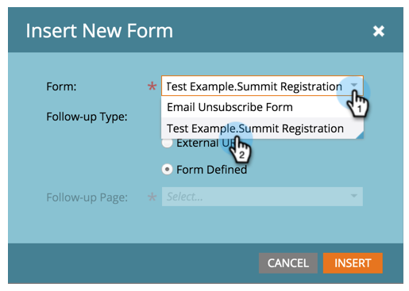

# 新增表單至引導式登陸頁面 {#add-a-form-to-a-guided-landing-page}

表單，集合登錄頁面。 登陸頁面，集合表單。

>[!PREREQUISITES]
>
>[建立引導式登錄頁面](/help/marketo/product-docs/demand-generation/landing-pages/guided-landing-pages/create-a-guided-landing-page.md)

1. 前往 **行銷活動** 的上界。

   

1. 尋找並選取您的登錄頁面，然後按一下 **編輯草稿**.

   

   >[!NOTE]
   >
   >引導式登錄頁面中的可用元素由範本定義。 如果在元素面板中未看到表單，請選取新範本或與範本建立者對話。

1. 按兩下 **表單** 在元素面板中。

   

1. 選擇要添加的表單。

   

1. 選擇後續頁面時，您有三個選項：

   * 登陸頁面 — 選擇Marketo登陸頁面
   * 外部URL — 挑選任何您想要的URL
   * 表單定義 — 使用表單層級中定義的設定

   >[!NOTE]
   >
   >後續頁面是使用者提交表單後會看到的頁面。

1. 在此範例中，我們將使用「表單定義」。 按一下 **插入**.

   

   幹得好！

   

現在，關閉登錄頁面編輯器，並 [核准登錄頁面草稿](/help/marketo/product-docs/demand-generation/landing-pages/understanding-landing-pages/approve-unapprove-or-delete-a-landing-page.md).
