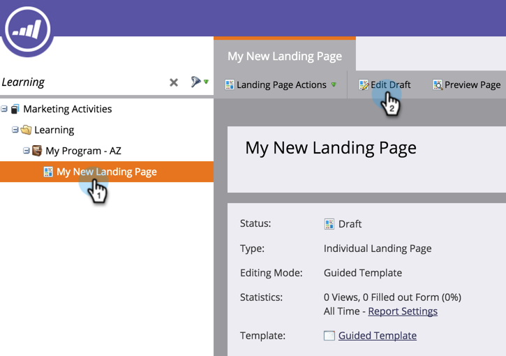

# 新增影像至引導式著陸頁面{#add-an-image-to-a-guided-landing-page}

與自由格式著陸頁面不同，引導式著陸頁面具有預先定義、鎖定的空間，供您新增影像。

1. 選取引導式登陸頁面。 按一下「編輯草稿&#x200B;**」。**

   

1. 按一下您要編輯的影像。 元素預留位置會在著陸頁面畫布中加以說明。

   

1. 選擇所需的影像，然後按一下&#x200B;**插入**。

   

1. 內容將顯示在元素放置器中。

   >[!NOTE]
   >
   >影像的大小取決於範本。 進一步瞭解[引導式著陸頁面範本](../../../../product-docs/demand-generation/landing-pages/landing-page-templates/create-a-guided-landing-page-template.md)。

   

   >[!TIP]
   >
   >目前不支援在編輯器中指定影像的連結。 請改用Rich Text元素。

