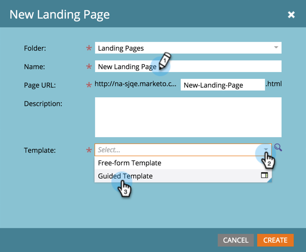

# 建立引導式登陸頁面 {#create-a-guided-landing-page}

>[!NOTE]
>
>登入頁面模式由其範本定義。 [進一步瞭解](/help/marketo/product-docs/demand-generation/landing-pages/understanding-landing-pages/understanding-free-form-vs-guided-landing-pages.md)自由格式與引導式登陸頁面範本。

>[!PREREQUISITES]
>
>若要使用自訂範本，您必須先[建立引導式登入頁面範本](/help/marketo/product-docs/demand-generation/landing-pages/landing-page-templates/create-a-guided-landing-page-template.md)。

## 在方案中建立引導式登陸頁面 {#create-a-guided-landing-page-in-a-program}

引導式登入頁面可建立為方案的本機資產，或在[!UICONTROL Design Studio]中建立以全域使用。

1. 移至&#x200B;**[!UICONTROL Marketing Activities]**。

   

1. 選取您的程式。

   

1. 按一下&#x200B;**[!UICONTROL New]**&#x200B;下拉式清單。 選擇「**[!UICONTROL New Local Asset]**」。

   

1. 選擇「**[!UICONTROL Landing Page]**」。

   

1. 為您的登陸頁面命名。 按一下&#x200B;**[!UICONTROL Template]**&#x200B;下拉式清單，然後選取&#x200B;**[!UICONTROL Guided Template]**。

   >[!NOTE]
   >
   >引導式登入頁面範本旁邊有圖示。 引導範本的結構化可讓這些範本保持完全的回應能力。

   

## 在Design Studio中建立登陸頁面 {#create-a-landing-page-in-design-studio}

1. 移至&#x200B;**[!UICONTROL Design Studio]**。

   

1. 按一下&#x200B;**[!UICONTROL New]**&#x200B;下拉式清單。 選擇「**[!UICONTROL New Landing Page]**」。

   

1. 為您的登陸頁面命名。 按一下&#x200B;**[!UICONTROL Template]**&#x200B;下拉式清單，然後選取&#x200B;**[!UICONTROL Guided Template]**。

   

1. 按一下「**[!UICONTROL Create]**」。

   

>[!TIP]
>
>URL會自動從程式和登入頁面名稱建構。 若要變更URL，請編輯&#x200B;**[!UICONTROL Page URL]**&#x200B;欄位。
>
>如果您不想在按一下&#x200B;**[!UICONTROL Open in editor]**&#x200B;後立即開啟編輯器，請清除&#x200B;**[!UICONTROL Create]**&#x200B;核取方塊。
