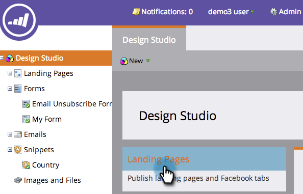
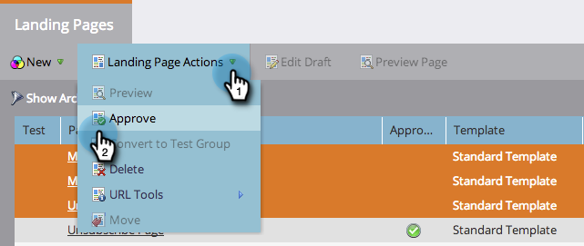

# 一次核准多個登陸頁面 {#approve-multiple-landing-pages-at-once}

1. 前往 **Design Studio**.

   

1. 按一下 **登陸頁面**.

   

1. 按住Ctrl鍵(Windows)或Command鍵(Mac)，然後按一下以選取多個登陸頁面。

   

   >[!TIP]
   >
   >請勿按一下實際的登入頁面名稱，這些是連結，會帶您前往頁面本身。

1. 選取您的登入頁面後，前往 **登陸頁面動作** 並按一下 **核准**.

   

   好了！ 您現在可以快速輕鬆地核准多個登陸頁面。

   

   >[!TIP]
   >
   >您也可以將上述步驟用於其他大量選項，例如取消核准或刪除。
