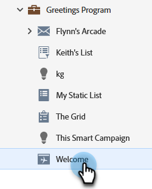

# 變更登陸頁面URL {#change-the-landing-page-url}

您可以修改登陸頁面的URL。 這可協助讓URL更容易記住並改善SEO。

1. 尋找並選取所需的登陸頁面。

   

1. 按一下&#x200B;**登陸頁面動作**&#x200B;下拉式清單，捲動至&#x200B;**URL工具**&#x200B;並選取&#x200B;**URL設定**。

   

1. 輸入&#x200B;**新URL**，選擇捨棄或重新導向舊URL，然後按一下&#x200B;**儲存**。

   

   >[!NOTE]
   >
   >如果您決定要保留兩個URL，則會自動建立重新導向規則。 深入瞭解[URL重新導向](/help/marketo/product-docs/demand-generation/landing-pages/personalizing-landing-pages/redirect-a-url-path.md)。
