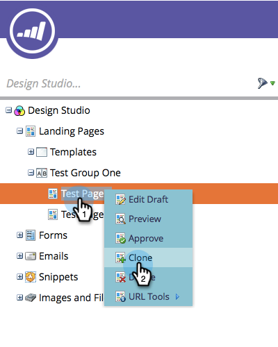
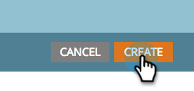
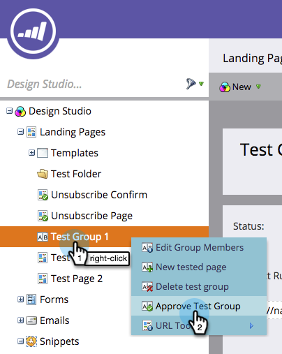

# 複製登入頁面測試群組 {#cloning-a-landing-page-test-group}

在Design Studio中，您可以找到並複製登入頁面測試群組。

1. 以滑鼠右鍵按一下未核准的頁面。 選取 **原地複製**.

   

1. 為此複製頁面提供新的 **名稱**. 複製的頁面會顯示在目前資料夾的底部。

   

1. 現在，按一下「 」以建立新的測試群組 **新增** 與領料 **新增測試群組**.

   

1. 在「建立新登陸頁面」對話方塊中，輸入新測試群組 **名稱**.

   

1. 在對話方塊底部，選取中的複製頁面 **可用的登陸頁面** 清單並按一下向右的箭頭，將其納入 **已測試的登入頁面**. 針對您要在此群組中執行的所有登入頁面執行此動作。

   

1. 完成後，按一下 **建立**.

   

1. 當您準備好要啟動測試群組時，請在樹狀結構中以滑鼠右鍵按一下該群組，然後選取 **核准測試群組**.

   

   群組現在將主動追蹤造訪和表單完成情形，因此您可以檢視哪個登入頁面成效最佳。
