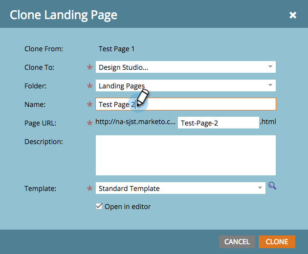

# 複製登錄頁面測試群組 {#cloning-a-landing-page-test-group}

從Design Studio中，您可以尋找並複製登錄頁面測試群組。

1. 以滑鼠右鍵按一下未核准的頁面。 選擇 **原地複製**.

   

1. 為此複製頁面提供新 **名稱**. 複製的頁面會顯示在您目前資料夾的底部。

   

1. 現在，按一下「 **新增** 和挑選 **新增測試群組**.

   

1. 在「建立新登錄頁面」對話方塊中，輸入新測試群組 **名稱**.

   

1. 在對話方塊底部，選取 **可用登錄頁面** 並按一下右方的箭頭，將其納入 **測試的登錄頁面**. 請針對您要加入此群組的所有登錄頁面執行此動作。

   

1. 完成後，按一下 **建立**.

   

1. 準備好啟動測試組時，按一下右鍵樹中的組，然後選擇 **批准測試組**.

   

   此群組現在會主動追蹤瀏覽次數和表單完成次數，以便您查看哪個登錄頁面的成效最佳。
