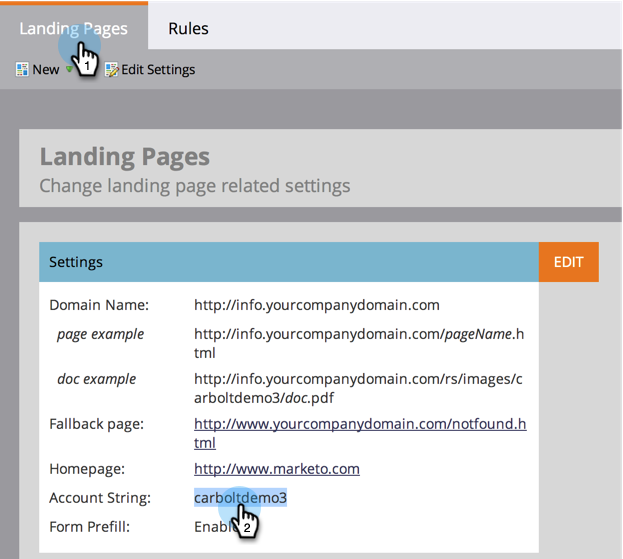

# 使用CNAME自訂您的登錄頁面URL {#customize-your-landing-page-urls-with-a-cname}

即使Marketo托管您的登錄頁面，URL仍可完全自訂。 沒有CNAME時的外觀：

`https://na-sj02.marketo.com/lp/mktodemoaccount126/UnsubscribePage.html`

它應該看起來的樣子：

`https://go.YourCompany.com/UnsubscribePage.html`

## 選擇CNAME {#choose-a-cname}

選取要進入登錄頁面之URL開頭的字詞。 它只是一個詞，應該相對短。 範例:

* go.YourCompany.com/NameOfPage.html
* info.YourCompany.com/NameOfPage.html
* pages.YourCompany.com/NameOfPage.html

一個詞（加上YourCompany.com）稱為CNAME。 你以後需要這個，記一下。

## 尋找您的帳戶字串 {#find-your-account-string}

1. 前往 **管理** 按一下 **登錄頁面**.

   

   >[!NOTE]
   >
   >**需要管理權限**

1. 在 **登陸** **頁面** 頁簽，複製 **帳戶** **字串** 從 **設定** 區段。

   

1. 您稍後也需要，請記下來。

## 向IT人員發送請求 {#send-request-to-it}

請您的IT人員設定下列CNAME:(取代 [CNAME] 和 [帳戶字串] 和上一步的文字。)

[CNAME].YourCompany.com > [帳戶字串].mktoweb.com

## 完成CNAME設定 {#complete-cname-setup}

1. 一旦IT建立CNAME後，請前往 **管理** 按一下 **登錄頁面**.

   

1. 在 **設定** 區段，按一下 **編輯**.

   

1. 在 **登錄頁面的網域名稱**，請輸入 **後援頁面**，請輸入 **首頁** 按一下 **儲存**.

   

>[!NOTE]
>
>如果您的Marketo登陸頁面無法使用，系統會將您的後援頁面做為頁面銷售機會，重新導向至。

幹得好！ 您的登錄頁面現在已與您的公司網域加上品牌。
