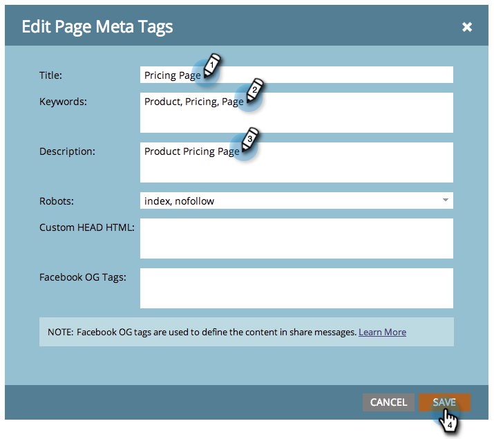

# 編輯登陸頁面標題和後設資料 {#edit-landing-page-title-and-metadata}

Marketo可讓您編輯登入頁面[中繼標籤以進行SEO ](https://www.w3schools.com/tags/tag_meta.asp)，以及自訂HTML的`<head>`部分。

1. 選取登入頁面並按一下&#x200B;**[!UICONTROL Edit Draft]**。

   

   >[!NOTE]
   >
   >登入頁面設計工具將在新視窗中開啟。

1. 在&#x200B;**[!UICONTROL Landing Page Actions]**&#x200B;底下，按一下&#x200B;**[!UICONTROL Edit Page Meta Tags]**。

   

1. 為您的頁面輸入&#x200B;**[!UICONTROL Title]**、**[!UICONTROL Keywords]**&#x200B;和&#x200B;**[!UICONTROL Description]**。 選取所需的&#x200B;**[!UICONTROL Robots]**&#x200B;選項，並針對HTML `<head>`區段輸入您要的任何自訂內容。 按一下「**[!UICONTROL Save]**」。

   

   >[!TIP]
   >
   >**[機器人](https://www.robotstxt.org/meta.html)是什麼意思？**
   >
   >**索引**：網頁可搜尋。 **追隨**：搜尋引擎可以追蹤索引頁面上的連結。

1. 隨時編輯標籤並核准登入頁面。
