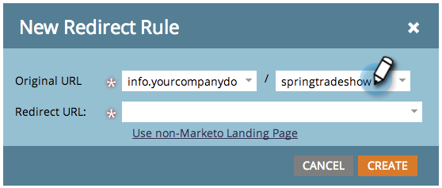
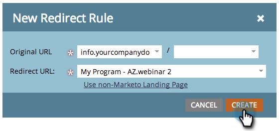

# 將 Marketo 登陸頁面重新導向至另一個頁面 {#redirect-a-marketo-landing-page-to-another-page}

如果您曾更新頁面的URL，並希望舊的URL仍然有效，請嘗試重新導向！ 設定很容易。

>[!NOTE]
>
>**需要管理員權限**

1. 在&#x200B;**[!UICONTROL Admin]**&#x200B;底下，按一下&#x200B;**[!UICONTROL Landing Pages]**。

   

1. 在「**[!UICONTROL Rules]**」標籤下，按一下「**[!UICONTROL New]**」，然後按「**[!UICONTROL New Redirect Rule]**」。

   

1. 按一下前&#x200B;**[!UICONTROL Original URL]**&#x200B;個下拉式清單，然後選取您的Marketo [CNAME](/help/marketo/product-docs/demand-generation/landing-pages/landing-page-actions/customize-your-landing-page-urls-with-a-cname.md)。

   

   >[!NOTE]
   >
   >請記住，您只能重新導向以Marketo [CNAME](/help/marketo/product-docs/demand-generation/landing-pages/landing-page-actions/customize-your-landing-page-urls-with-a-cname.md)開頭的URL。

1. 在第二個&#x200B;**[!UICONTROL Original URL]**&#x200B;欄位中選擇您要重新導向的登入頁面。

   

   >[!NOTE]
   >
   >即使頁面或目錄不存在，您也可以輸入任何URL路徑。

1. 按一下&#x200B;**[!UICONTROL Redirect URL]**&#x200B;下拉式清單，然後選取您要重新導向訪客的頁面。

   

1. 按一下「**[!UICONTROL Create]**」。

   

   >[!TIP]
   >
   >若要重新導向至Marketo外部的網頁，請按一下&#x200B;**[!UICONTROL Use non-Marketo Landing Page]**。

   >[!MORELIKETHIS]
   >
   >[重新導向URL路徑](/help/marketo/product-docs/demand-generation/landing-pages/personalizing-landing-pages/redirect-a-url-path.md)
